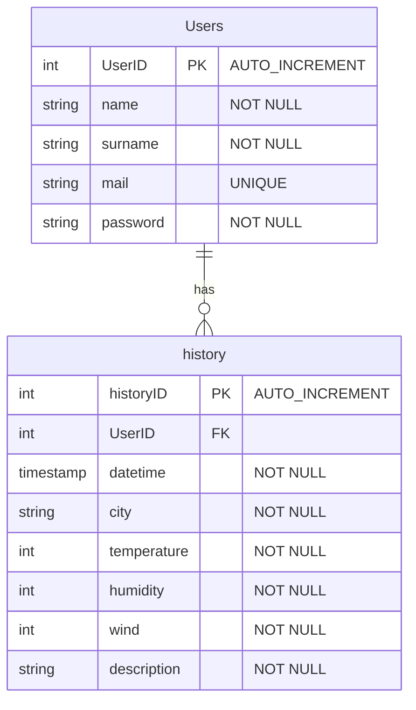

# Introduzione
La web app **Weather Report** permette a un utente di sapere il meteo in tempo reale di tutte le città del mondo con facilità e immediatezza.
Weather Report è stato realizzato appoggiandosi sull'infrastruttura gratuita di [Altervista](https://it.altervista.org/), in quanto permette la creazione di un sito web con PHP, database MySQL e accesso tramite il protocollo FTP. Ma le funzionalità gratuite non sono finite qui:
- se lo si desidera è possibile richiedere il protocollo HTTPS per permettere di accedere ai contenuti del proprio sito tramite una connessione sicura;
- viene messo a disposizione il file ```htaccess```, un semplice file di testo contenente le direttive di Apache per la configurazione.

Se un utente, sbadatamente, provasse ad accedere al sito tramite il protocollo HTTP, la richiesta verrà sempre reindirizzata col protocollo HTTPS.
Questo è possibile inserendo nel file htaccess la seguente porzione di codice:

```
# # av:php5-engine

AddHandler av-php8 .php
RewriteCond %{HTTP:X-Forwarded-Proto} !https
RewriteCond %{HTTPS} off
RewriteRule .* https://weatherreport.altervista.org%{REQUEST_URI} [L,R=301]
```

Weather Report si appoggia sulle API di [**OpenWeatherMap**](https://openweathermap.org/) per ottenere le migliori previsioni meteo.

---

# Database
Come citato nel paragrafo precedente, il DBMS utilizzato è MySQL, contenente le tabelle ```Users``` e ```history```. Rispettivamente, nella prima ci sono le informazioni dell'utente registrato e nell'altra le ricerche meteo fatte dagli utenti.
La relazione tra le due tabelle viene stabilita tramite la _chiave primaria_ ```Users.UserID``` (assegnata a ogni utente dopo la registrazione) e la _chiave esterna_ ```history.UserID```.

Schema ER:



Esempio di una riga della tabella ```Users```:

|   UserID  |   name  |  surname | mail | password |
|:---------:|:-------:|:------:|:------:|:------:|
|   1  |   Antonino  |    Mastronardo  | anto@outlook.it | $2y$10$MR1oxSbKeVGjxlr7 (...)

Prima di salvare la password nel database, questa subisce una funzione di Hashing, ```PASSWORD_BCRYPT```, che utilizza il ```CRYPT_BLOWFISH algorithm```.

Esempio di una riga della tabella ```history```:

| historyID | UserID |  datetime               | city    | temperature | humidity | wind | description  |
|:---------:|:------:|:-----------------------:|:-------:|:-----------:|:--------:|:----:|:------------:|
|   29      |   1    |    2023-05-18 23:25:54  | rometta | 14          | 80       | 1    | broken clouds| 


## Avoiding the SQLi
Per evitare l'iniezioni di codice SQL malevolo atto a danneggiare il database mi sono mosso su due fronti:
- il primo agendo sul file htaccess impedendo l'uso della parola ```drop``` nell'URL
```
RewriteEngine On
RewriteCond %{QUERY_STRING} (drop) [NC]
RewriteRule ^(.*)$ https://weatherreport.altervista.org? [R=302,L]
```
- il secondo tramite PHP
  1) il primo passo è usare la funzione ```mysqli_real_escape_string()``` che consiste in una pre-elaborazione dei dati inviati tramite un modulo web, convertendo i caratteri speciali ostili alla query e rendendo innocui i tentativi di hacking;
  2) il secondo passo è la _SQL prepared statement_ che indica la preparazione anticipata delle query SQL prima dell’invio al server per l’inserimento di valori nel database.
     In questo caso si utilizzano le funzioni ```prepare``` e ```bind_param```.

---

# Back end
## Cosa sono le RESTful API
Per la comunicazione col database sono state create delle API (_Application Programming Interface_) basate sul paradigma REST (_REpresentational State Transfer_), il quale consiste in una serie di principi architetturali fondati sull'identificazione di una risorsa tramite URI (_Uniform Resource Identifier_), alla quale  è possibile associare delle operazioni, definite dall'URI in questione e dal metodo HTTP utilizzato per raggiungere una determinata risorsa.

Le operazioni HTTP seguono una mappatura con le operazioni CRUD: 

| CRUD   | HTTP   |
|:------:|:------:|
| CREATE | POST   |
| READ   | GET    |
| UPDATE | PUT    |
| DELETE | DELETE |


## API implementate per il sito


---

# Front end
## Pagina di Login e di Registrazione
## Pagina Home
## Pagina dell'Utene
## Pagina della Cronologia


