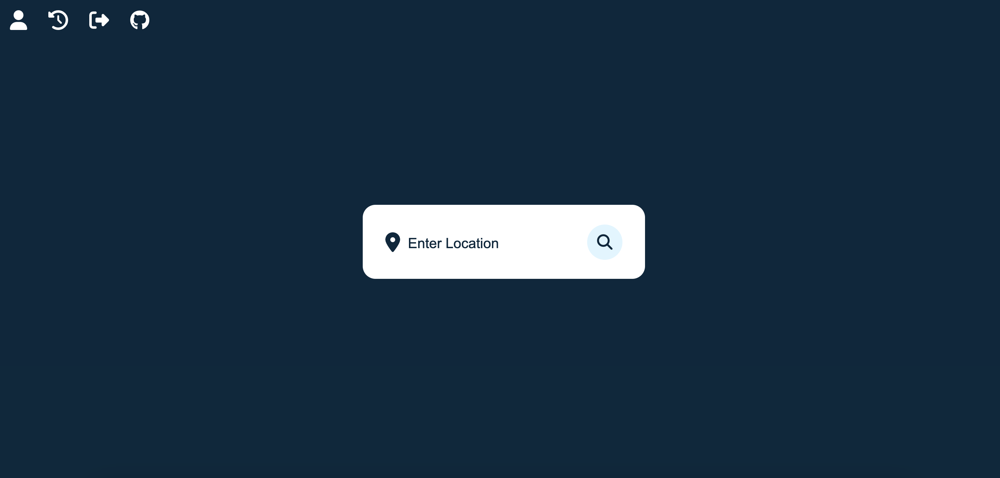

# Introduzione
La web app **Weather Report** permette a un utente di sapere il meteo in tempo reale di tutte le città del mondo con facilità e immediatezza.
Weather Report è stato realizzato appoggiandosi sull'infrastruttura gratuita di [Altervista](https://it.altervista.org/), in quanto permette la creazione di un sito web con PHP, database MySQL e accesso tramite il protocollo FTP. Ma le funzionalità gratuite non sono finite qui:
- se lo si desidera è possibile richiedere il protocollo HTTPS per permettere di accedere ai contenuti del proprio sito tramite una connessione sicura;
- viene messo a disposizione il file ```htaccess```, un semplice file di testo contenente le direttive di Apache per la configurazione.

Se un utente, sbadatamente, provasse ad accedere al sito tramite il protocollo HTTP, la richiesta verrà sempre reindirizzata col protocollo HTTPS.
Questo è possibile inserendo nel file htaccess la seguente porzione di codice:

```
# # av:php5-engine

AddHandler av-php8 .php
RewriteCond %{HTTP:X-Forwarded-Proto} !https
RewriteCond %{HTTPS} off
RewriteRule .* https://weatherreport.altervista.org%{REQUEST_URI} [L,R=301]
```

Weather Report si appoggia sulle API di [**OpenWeatherMap**](https://openweathermap.org/) per ottenere le migliori previsioni meteo.
Per potere accedere a questi dati è necessario inviare una richiesta HTTP alle API sopra citate, specificando come parametro l'API Key ricevuta in fase di registrazione nel loro sito ufficiale. Nel file ```index.js``` andiamo ad eseguire questa operazione.

---

# Database
Come citato nel paragrafo precedente, il DBMS utilizzato è MySQL, contenente le tabelle ```Users``` e ```history```. Rispettivamente, nella prima ci sono le informazioni dell'utente registrato e nell'altra le ricerche meteo fatte dagli utenti.
La relazione tra le due tabelle viene stabilita tramite la _chiave primaria_ ```Users.UserID``` (assegnata a ogni utente dopo la registrazione) e la _chiave esterna_ ```history.UserID```.

Schema ER:


Esempio di una riga della tabella ```Users```:

|   UserID  |   name  |  surname | mail | password |
|:---------:|:-------:|:------:|:------:|:------:|
|   1  |   Antonino  |    Mastronardo  | anto@outlook.it | $2y$10$MR1oxSbKeVGjxlr7 (...)

Prima di salvare la password nel database, questa subisce una funzione di Hashing, ```PASSWORD_BCRYPT```, che utilizza il ```CRYPT_BLOWFISH algorithm```.

Esempio di una riga della tabella ```history```:

| historyID | UserID |  datetime               | city    | temperature | humidity | wind | description  |
|:---------:|:------:|:-----------------------:|:-------:|:-----------:|:--------:|:----:|:------------:|
|   29      |   1    |    2023-05-18 23:25:54  | rometta | 14          | 80       | 1    | broken clouds| 


## Avoiding the SQLi
Per evitare l'iniezioni di codice SQL malevolo atto a danneggiare il database mi sono mosso su due fronti:
- il primo agendo sul file htaccess impedendo l'uso della parola ```drop``` nell'URL
```
RewriteEngine On
RewriteCond %{QUERY_STRING} (drop) [NC]
RewriteRule ^(.*)$ https://weatherreport.altervista.org? [R=302,L]
```
- il secondo tramite PHP
  1) il primo passo è usare la funzione ```mysqli_real_escape_string()``` che consiste in una pre-elaborazione dei dati inviati tramite un modulo web, convertendo i caratteri speciali ostili alla query e rendendo innocui i tentativi di hacking;
  2) il secondo passo è la _SQL prepared statement_ che indica la preparazione anticipata delle query SQL prima dell’invio al server per l’inserimento di valori nel database.
     In questo caso si utilizzano le funzioni ```prepare``` e ```bind_param```.

---

# Back end
## Cosa sono le RESTful API
Per la comunicazione col database sono state create delle API (_Application Programming Interface_) basate sul paradigma REST (_REpresentational State Transfer_), il quale consiste in una serie di principi architetturali fondati sull'identificazione di una risorsa tramite URI (_Uniform Resource Identifier_), alla quale  è possibile associare delle operazioni, definite dall'URI in questione e dal metodo HTTP utilizzato per raggiungere una determinata risorsa.

Le operazioni HTTP seguono una mappatura con le operazioni CRUD: 

| CRUD   | HTTP   |
|:------:|:------:|
| CREATE | POST   |
| READ   | GET    |
| UPDATE | PUT    |
| DELETE | DELETE |


## API implementate per il sito
All'interno del file ```api.php``` sono presenti tutte le API implementate per l'interazione col database.

Sulla tabella ```history``` si possono eseguire le seguenti operazioni:
```POST```: ogni ricerca effettuata dall'utente viene salvata nella tabella
```GET```: l'utente può visualizzare la cronologia delle ricerche effettuate
```DELETE```: l'utente può cancellare una riga dalla tabella

Sulla tabella ```Users``` si possono eseguire le seguenti operazioni:
```POST```: operazione per effettuare il login
```POST```: operazione per effettuare il logout
```POST```: operazione per registrarsi
```GET```: l'utente può visualizzare il nome, il cognome e la mail con le quali si è registrato
```PUT```: l'utente può modificare la propria password
```DELETE```: l'utente può eliminare il proprio account

Un esempio è l'utilizzo di una richiesta GET ad un URI ```https://weatherreport.altervista.org/api.php/history/view_weather``` per comunicare al server che vogliamo operare sulla risorsa _history_ (che equivale alla tabella della cronologia nel database) e che si vuole effettuare una _lettura_ (una ```SELECT```), avvalorato dalla richiesta _GET_ e dell'ulteriore parte ```view_weather``` presente nell'URI.

---

# Front end
Il front end è stato realizzato con un insieme di componenti CSS (Cascading Style Sheets) per ottenere un design _ben strutturato_ e _responsive_, fornendo una esperienza utente ottimale e gradevole.

- Per le pagine di _Login_ e _Registrazione_ è stato utilizzato il CSS offerto da **AdminLTE**;
- Per la pagina di _Home_ è stato realizzato un CSS personalizzato;
- Per le pagine dell'_Utente_ e della _Cronologia_ è stato utilizzato non solo un CSS personalizzato, ma anche quello offerto da [**AdminLTE**](https://adminlte.io/) e [**Bootstrap**](https://getbootstrap.com/).

Per effettuare richieste al server ed elaborare i dati ottenuti aggiornando dinamicamente la pagina web senza dover ricaricare l’intera pagina è stato utilizzato **jQuery**.
jQuery è una libreria JavaScript cross-browser veloce, versatile ed estensibile. L'API di jQuery consente di gestire con semplicità delle attività che risulterebbero lunghe o complesse in JavaScript. Inoltre, jQuery semplifica eventi come le chiamate AJAX (_Asynchronous JavaScript and XML_) e la manipolazione del DOM (_Document Object Model_).

## Pagina di Login e di Registrazione
Per poter accedere ai servizi di **Weather Report** è necessario essere registrati ed effttuare il login.

<p align="center">
  
</p>

Non sei registrato? Farlo è estramamente semplice!

<p align="center">
  
</p>


## Pagina Home
Dopo il login si viene reinderizzati alla Home, costituita da diversi elementi:
- il box dove scrivere la località della quale ci interessa il meteo;
- l'icona _utente_ che reinderizza alla pagina Utente;
- l'icona _cronologia_ che reinderizza alla pagina Cronologia;
- l'icona di _logout_ che reinderizza alla pagina di login se la richiesta è andata a buon fine;
- l'icona di _GitHub_ che reinderizza alla repository del progetto.

<p align="center">
  
</p>

Se avete inserito una località (esistente) nel box e si preme la lente di ingradimento... ecco a Voi il risultato!

<p align="center">
  
</p>

## Pagina dell'Utente
La pagina dell'Utente è costituita da tre elementi:
- l'icona di una _casa_ che reinderizza alla pagina Home;
- l'icona di _GitHub_ che reinderizza alla repository del progetto;
- un _container_ contenente:
  1) nome, cognome e mail usate durante la fase di registrazione;
  2) uno spazio apposito per aggiorna la propria password;
  3) uno spazio apposito per eliminare il proprio account.

<p align="center">
  
</p>

## Pagina della Cronologia
La pagina della Cronologia è costituita da tre elementi:
- l'icona di una _casa_ che reinderizza alla pagina Home;
- l'icona di _GitHub_ che reinderizza alla repository del progetto;
- una _tabella_ contenente:
  1) le informazioni riguardanti le ricerche fatte dall'utente;
  2) un bottone per cancellare una ricerca dalla tabella.

<p align="center">
  
</p>